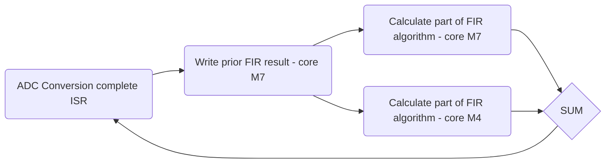

STM32H7 Multicore FIR
======================
:star: Star me on GitHub — it helps!

STM32H7 Multicore FIR is a finite impulse response filter implementation for family of multicore processors from STM32 - family H7. Algorithm runs in parallel on both cores and this helps users to achieve high sampling frequencies or high FIR filter order.

## Table of content

- [Setup](#setup)
	- [Version]((#version))
- [Specification](#specification)
- [On target tests](#specification)
- [License](#license)
- [Links](#links)

## Setup

### Version

This document is for the latest  **[STM32H7_MulticoreFIR](https://github.com/PavolKostolansky/STM32H7_MulticoreFIR)** **1.0.0 release and later**. 

Built with:

- STM32CubeIDE **Version: 1.5.1**
- Build: 9029_20201210_1234 (UTC)

### Import of the project

To import project in STM32CubeIDE is needed:
- In main menu go to **File**
- Choose option **Open Projects from File System...**
- In option **Import Source** choose cloned repository

> **Note:** For multicore debugging please read **[Multicore debugging](https://www.st.com/resource/en/application_note/dm00629855-getting-started-with-projects-based-on-dualcore-stm32h7-microcontrollers-in-stm32cubeide-stmicroelectronics.pdf)**

## Specification
### Microcontroller
#### Core M7:

- Running on frequency 480 MHz
- Uses ADC1, DAC1 and TIM3

#### Core M4:

- Running on frequency 240 MHz
- Uses **-**

#### ADC1:
- Single Ended
- Clock prescaler /4
- Sampling frequency is 192KHz
- Conversion is triggered with TIM3
- Resolution is 16Bit
- DMA stores data after conversion and trigger conversion complete ISR

#### DAC1:
- Mode - Connected to external pin only
- Output buffer enabled
- Sampling frequency is 192KHz
- Resolution is 12Bit

#### Context execution view:

#### Pinout:

- **DAC1** output is mapped to pin **PA4**
- **ADC1** output is mapped to pin **PF11**

### FIR Filter
FIR Filter algorithm is splitted between two cores. Inside **[settings header](https://github.com/PavolKostolansky/STM32H7_MulticoreFIR/blob/main/Common/Inc/settings.h)** you can easily change the splitter macro that defines how many samples are calculated on core M7 and core M4. On the UML diagram below you can see FIR filter execution flow.

For the FIR filter design you can use **[Matlab filter designer](https://www.mathworks.com/help/signal/ug/introduction-to-filter-designer.html;jsessionid=420fe8cddcf95e47397263033764)**. The example below is from this package and coefficient from this design are currently used in the  **[settings source](https://github.com/PavolKostolansky/STM32H7_MulticoreFIR/blob/main/Common/Src/settings.c)**.

> **Warning:** If you change order of filter, you have to change also macro **FILTER_ORDER** inside **[settings header](https://github.com/PavolKostolansky/STM32H7_MulticoreFIR/blob/main/Common/Inc/settings.h)**
